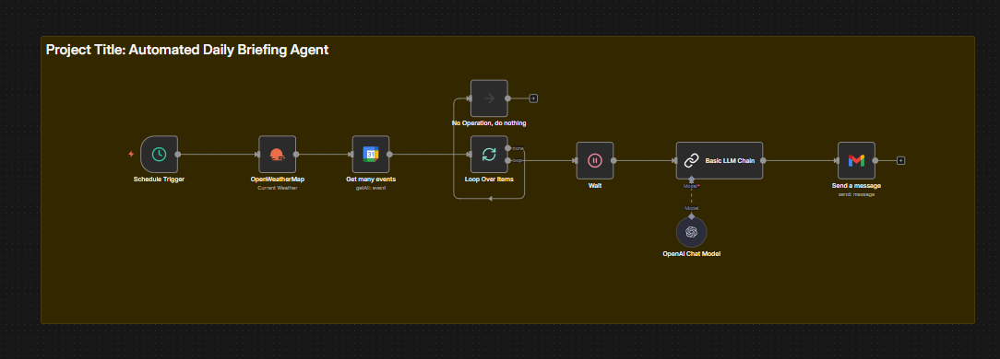

# n8n-smart-daily-briefing-agent
An AI-powered executive assistant workflow using n8n, OpenAI, and Google Calendar.

# 🤖 AI-Powered Smart Daily Briefing Agent

## 🚀 Project Overview
This project is an intelligent automation workflow that acts as a **Personal Executive Assistant**. Instead of manually checking weather apps, calendars, and emails every morning, this agent autonomously aggregates data, analyzes it using **GPT-4o**, and delivers a concise executive summary to my inbox at 6:00 AM.

**Problem Solved:** Reduces cognitive load in the morning by consolidating fragmented information into a single actionable report.

## 📸 Workflow Diagram

*(Note: Upload your screenshot and ensure the filename matches)*

## 🧠 Key Features
* **LangChain Integration:** Uses n8n's Chain LLM node to structure the AI's "personality" as a professional executive assistant.
* **Context-Aware AI:** The AI agent analyzes calendar density to suggest focus areas (e.g., "No meetings today? Great day for deep work.").
* **Multi-API Orchestration:**
    * **OpenWeatherMap:** Fetches real-time conditions for Taguig, PH.
    * **Google Calendar:** Pulls the day's agenda.
    * **OpenAI (GPT-4o-mini):** Synthesizes the raw data into natural language.
    * **Gmail:** Formats and sends the HTML briefing.

## 🛠️ How to Use
1.  Download the `automated_briefing.json` file.
2.  Import it into your self-hosted or cloud n8n instance.
3.  Configure your credentials for:
    * OpenAI API
    * Google Cloud (Calendar & Gmail)
    * OpenWeatherMap
4.  Activate the workflow!

---
**Created by Clarence Sulit**
[Link to Portfolio/GitHub Profile]
